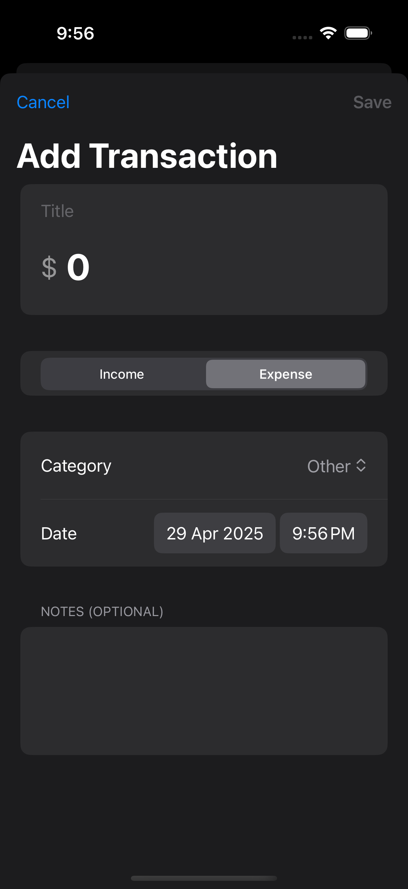
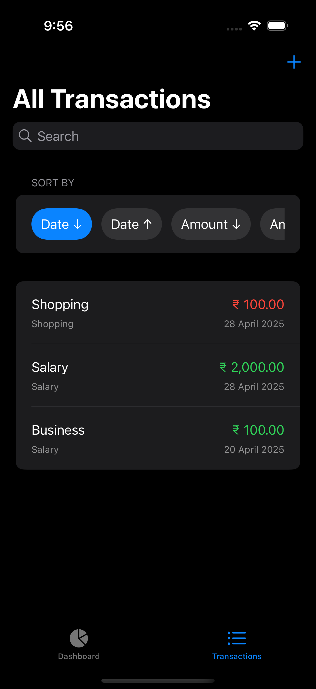

# 💰 PennyGuard

PennyGuard is a simple yet powerful personal finance app built using SwiftUI, SwiftData, and The Composable Architecture (TCA). Track your income and expenses effortlessly with a modern UI and robust architecture.

## 🛠 Features

- 📈 Track income and expenses by category
- 💸 View transactions with custom notes, dates, and types
- 🧠 Categorize transactions (e.g., Food, Travel, Salary)
- 🗓 Filter data by time frames (Week, Month, Year, All)
- 💾 Built using native **SwiftData** persistence
- 🧩 Modular & testable architecture powered by **TCA**

---

## 📱 Demo

🎥 Demo video: *Coming soon* 

## 📱 Screenshots

| Dashboard | Add Transaction | Transaction List |
|:---------:|:----------------:|:----------------:|
|  |  |  |


 ---

## 🏗 Architecture Overview

PennyGuard follows **Clean Architecture principles** with a feature-first modular design.

### Core Architectural Decisions

- **UI Layer:** SwiftUI  
- **State Management:** The Composable Architecture (TCA)  
- **Persistence Layer:** SwiftData (`ModelContext`)  
- **Concurrency:** Structured concurrency using async/await  
- **Dependency Injection:** Environment-based injection for testability  
- **Testing:** Reducer-level unit tests using TCA TestSupport
  
---

## 🧠 Why TCA?

TCA ensures:

- Predictable state transitions  
- Explicit side-effect handling  
- Highly testable business logic  
- Scalable feature isolation  

While TCA introduces additional boilerplate, it significantly improves long-term maintainability.

---

## 🛠 Tech Stack

| Layer        | Technology |
|--------------|------------|
| UI           | SwiftUI |
| State        | The Composable Architecture (TCA) |
| Persistence  | SwiftData |
| Concurrency  | async/await |
| Testing      | XCTest, TCA TestSupport |
| Platform     | iOS 17+ |

---
## 🧪 Tests

Includes unit tests for the reducer logic and business rules.

To run tests:

```
⌘ + U
```


## ⚙️ Installation

1. Clone the repository  
2. Open `PennyGuard.xcodeproj`  
3. Build & Run on iOS 17+  

